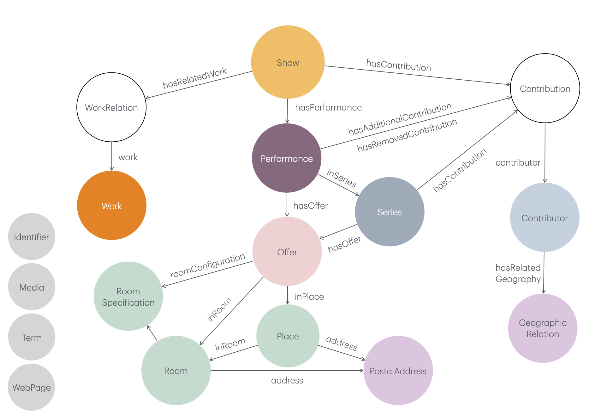

# Site de révision

### Classes principales
Ces pages sont généré par [json-schema-for-humans](https://github.com/coveooss/json-schema-for-humans). 
- [Spectacle](spectacle.html)
- [Représentation](représentation.html)
- [Série](série.html)
- [Offre](offre.html)
- [Lieu](lieu.html)
- [Salle](salle.html)
- [Contributeur](contributeur.html)
- [Oeuvre](oeuvre.html)

### Classes utilitaires
- [Adresse](utilities/postal_address.html)
- [Association géographique](utilities/geographic_relation.html)
- [Contribution](utilities/contribution.html)
- [Configuration de salle](utilities/room_specification.html)
- [Identifiant](utilities/identifier.html)
- [Média](utilities/media.html)
- [Terme](utilities/term.html)
- [Page Web](utilities/web_page.html)

### vocabularies contrôlés
- [Accessibilité Universelle](vocabularies/accessibilitéUniversellesTermes.skos.html)
- [Avertissements](vocabularies/avertissement.skos.html)
- [Disciplines artistiques](vocabularies/disciplines-asq.html)
- [Public cible](vocabularies/publicCible.skos.html)
- [Types d’association géographiques](vocabularies/associationGéographiqueType.skos.html)
- [Types de configurations de salles](vocabularies/configurationSalleTermes.skos.html)
- [Types de contenus](vocabularies/contenusType.skos.html)
- [Types de contributions](vocabularies/contributionType.skos.html)

